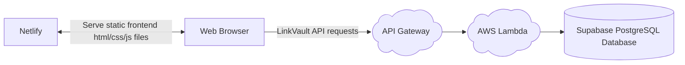
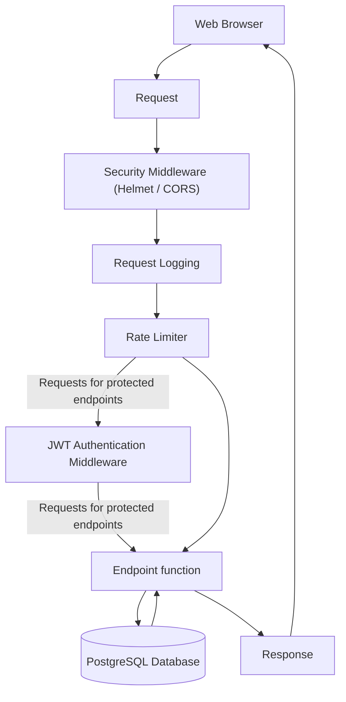

# LinkVault

LinkVault is a full-stack web application for managing web bookmarks. Using LinkVault allows users to easily access their web bookmarks privately on any device or browser.

### Motivation

My motivation behind creating LinkVault was to gain backend development experience and exposure to a tech stack that I was not familiar with. This is my first project with TypeScript and AWS Lambda and it provided me with valuable experience to carry forward.

### Features

- User registration and JWT-based authentication
- Create, list, update, and delete web bookmarks
- Per-user bookmark isolation
- Global and route-specific rate limiting
- Structured logging via AWS CloudWatch
- Comprehensive test coverage using Jest and Supertest
- Health check endpoint for dependency monitoring
- Cloud-deployed with AWS Lambda, API Gateway, Supabase PostgreSQL, and Netlify

---
High-Level Architecture
---

---
Request-Response Cycle
---

### Endpoints

| Endpoint Path | Protected Endpoint | Usage |
| -------- | -------- | -------- |
| POST /auth/register | No | Register a new LinkVault user |
| GET /auth/verify/:verification_token | No | Verify a LinkVault Account (accessed via verification email link) |
| POST /auth/verify/resend | Yes - Email Verification JWT | Resend a verfication email with a new verification token. |
| POST /auth/login | No | Login to a LinkVault account |
| POST /bookmarks | Yes - Auth JWT | Create a new web bookmark |
| GET /bookmarks | Yes - Auth JWT | Fetch all of the logged-in user's bookmarks |
| GET /bookmarks/:id | Yes - Auth JWT | Fetch a bookmark by id |
| PUT /bookmarks/folder | Yes - Auth JWT | Change the name of a bookmark folder |
| PUT /bookmarks/bookmark/:id | Yes - Auth JWT | Update a bookmark by id |
| DELETE /bookmarks/:id | Yes - Auth JWT | Delete a bookmark by id |

### Project Status

LinkVault is complete and deployed. Future improvements may be considered and implemented at a later date.
